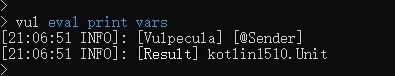
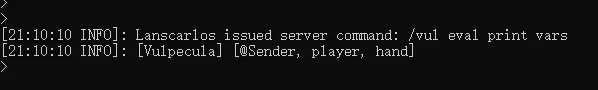

# 脚本执行者与 Switch 语句

不知道大家在使用 `Tell`、`Title`、`ActionBar`、`Health` 语句的时候有没有这样的疑惑？

这一系列语句，都是基于脚本执行者去操作的。简单来说就是需要依赖当前脚本选中的玩家才能生效的，并且只能围绕那一个玩家去操作。如果脚本执行者不是玩家，那么使用这些语句还可能会出现报错。


那有没有什么办法可以改善一下这方面的语句呢？答案是有的。

## Switch 语句

```
switch {player} then {action}
```

<details>
    <summary>「展开 / 收起详情」💠 Switch 语句</summary>
    <iframe src={"https://www.yuque.com/sacredcraft/kether/reference?view=doc_embed&inner=oSXPL"} width={'100%'} height={'500'}/>
</details>

这个语句的结构非常简单，根据 `{action}` 处填写的玩家名，系统会自动将当前脚本执行者更换为指定的玩家

当然啦，如果你指定的玩家不在线，那么脚本执行者会被设置为空 `null` 哦


既然可以随意切换脚本执行者，那么 `Tell`、`Title`、`ActionBar`、`Health` 的问题自然也就迎刃而解了嘛，哪怕你想给全服玩家发送 `ActionBar` 那都是没有问题的。


```ruby
/* 遍历全服玩家，发送 ActionBar */
for it in players then {
    switch &it
    actionbar "新年快乐"
}

/* 给 SVIP 用户开启飞行模式 */
for it in players then {
    switch &it
    if perm "permission.svip" then {
        player flying to true
        actionbar "飞行模式已开启"
    }
}
```


那么，如果我想再切换回原来的玩家那该怎么办呢？

`switch` 一旦切换玩家，原来的玩家就会被无情替换掉，基本上是找不回来的。

但是请不要忘了，`sender` 语句可以获取当前脚本执行者的名字（这个好像官方文档没写？）

那你有没有想到什么思路？

对嘛，在你用 `switch` 切换之前，先通过 `sender` 把当前玩家名字存下来就可以了呀

```ruby
/* 保存原玩家 */
set playerName to sender

/* 切换到其他玩家 */
for it in players then {
    switch &it
    actionbar "新年快乐"
}

/* 最后再切换回原玩家 */
switch &playerName
```


## 脚本执行者变量

接下来讲些糕级点的东西

首先我们在 **控制台 **执行一下这样的语句：`/vul eval print vars`

这个语句的作用是打印当前脚本中的所有定义的变量名





你也可以去其他插件试试这个语句，看看打印的结果都有哪些变量。

细心观察后，你会发现不管在哪里运行，打印出来的变量始终都能看见 `@Sender` 的身影

没错，这个 `@Sender` 变量就是当前脚本的执行者，它以变量的形式存于运行的脚本当中。

你使用 `switch` 改变脚本执行者实际上就是在改变这个变量的值

虽然变量的命名很奇怪，不过 Kether 对此并无限制，因此它是合法的。

我们依旧可以通过 `&@Sender` 来获取该变量


我猜你们也许会好奇这个变量存的是什么：


懂开发的读者应该一眼就知道了，这存的就是玩家对象。


那它有什么用呢？在原生 Kether 里可能没啥用，但在 Vulpecula 的支持下，我们可以通过拓展属性用法获取与该玩家相关的很多数据

[Player 玩家属性](https://www.yuque.com/lanscarlos/vulpecula-doc/property-player)


例如获取玩家主手的物品


至于其他的用法，就有待各位读者慢慢去摸索咯~
